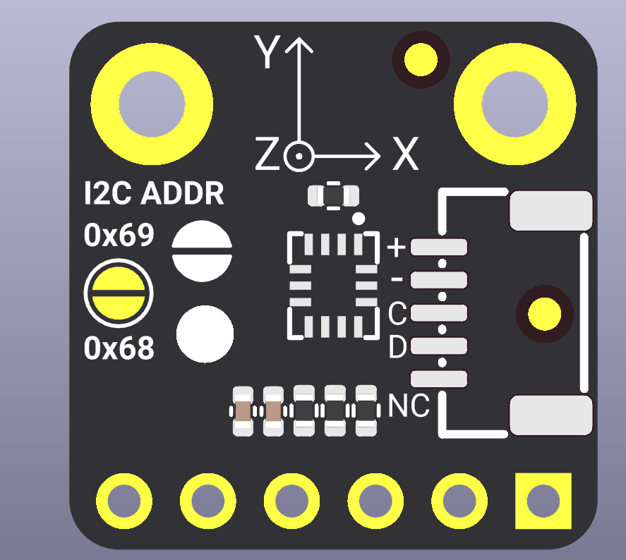
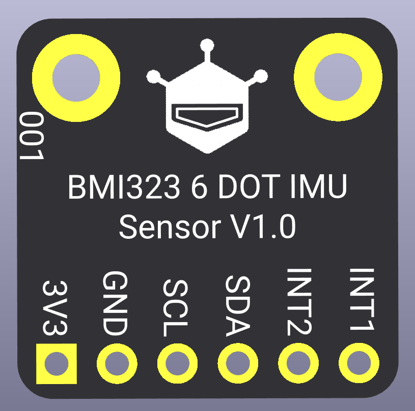

# DFRobot_BMI323
- [中文版](./README_CN.md)

The BMI323 is a low-power, high-performance 6-axis IMU sensor that combines a 3-axis accelerometer and a 3-axis gyroscope. It communicates via I2C interface and provides comprehensive motion detection capabilities including step counting, any-motion detection, no-motion detection, significant motion detection, tap detection, tilt detection, orientation detection, and flat detection.

This sensor is ideal for wearable devices, smart watches, fitness trackers, and IoT applications where motion sensing and power efficiency are critical. The BMI323 features hardware-based motion detection algorithms that operate independently, allowing for ultra-low power consumption without requiring constant MCU intervention. With configurable interrupt pins (INT1 and INT2), the sensor can efficiently notify the host system of motion events, making it perfect for battery-powered applications.

**Key Features:**

- 6-axis motion sensing (3-axis accelerometer + 3-axis gyroscope)
- Hardware step counter with interrupt support
- Multiple motion detection modes (any-motion, no-motion, significant motion)
- Gesture recognition (tap, tilt, orientation, flat detection)
- Configurable output data rates (ODR) from 0.78Hz to 6400Hz
- Multiple operating modes (low power, normal, high performance)
- I2C interface with configurable address (0x68/0x69)
- Dual interrupt pins for flexible event handling

<p align="center">
  
  
</p>

## Product Link (https://www.dfrobot.com)
    SKU: SEN0693

## Table of Contents

  * [Summary](#summary)
  * [Installation](#installation)
  * [Methods](#methods)
  * [Compatibility](#compatibility)
  * [History](#history)
  * [Credits](#credits)

## Summary

This Arduino library provides a comprehensive interface for the BMI323 6-axis IMU sensor. It supports:

**Basic Functions:**

- Initialize sensor via I2C interface
- Configure accelerometer and gyroscope parameters (ODR, range, operating mode)
- Read 6-axis sensor data (accelerometer + gyroscope) simultaneously

**Advanced Features:**

- Step counter with interrupt support
- Any-motion detection interrupt
- No-motion detection interrupt
- Significant motion detection interrupt
- Flat detection interrupt
- Orientation detection interrupt (portrait/landscape, face up/down)
- Tap detection interrupt (single/double/triple tap)
- Tilt detection interrupt

All motion detection features support configurable thresholds and can be mapped to either INT1 or INT2 interrupt pins for flexible system integration.

## Installation

To use this library, first download the library file, paste it into the \Arduino\libraries directory, then open the examples folder and run the demo in the folder.

## Methods

```C++
  /**
   * @fn DFRobot_BMI323
   * @brief Constructor
   * @details Constructor - I2C interface
   * @param wire TwoWire object pointer, default &Wire
   * @param i2cAddr I2C address, default 0x69
   * @return None
   */
  DFRobot_BMI323(TwoWire *wire = &Wire, uint8_t i2cAddr = 0x69);

  /**
   * @fn begin
   * @brief Initialization function
   * @details Initialize I2C interface, chip registers and feature context
   * @param None
   * @return bool type, indicates the initialization status
   * @retval true Initialization successful
   * @retval false Initialization failed
   */
  bool begin(void);

  /**
   * @fn configAccel
   * @brief Configure accelerometer
   * @param odr Output data rate selection (see: eAccelODR_t)
   * @n Available rates:
   * @n - eAccelODR0_78125Hz:  0.78125 Hz
   * @n - eAccelODR1_5625Hz:   1.5625 Hz
   * @n - eAccelODR3_125Hz:    3.125 Hz
   * @n - eAccelODR6_25Hz:     6.25 Hz
   * @n - eAccelODR12_5Hz:     12.5 Hz
   * @n - eAccelODR25Hz:       25 Hz
   * @n - eAccelODR50Hz:       50 Hz
   * @n - eAccelODR100Hz:      100 Hz
   * @n - eAccelODR200Hz:      200 Hz
   * @n - eAccelODR400Hz:      400 Hz
   * @n - eAccelODR800Hz:      800 Hz
   * @n - eAccelODR1600Hz:     1600 Hz
   * @n - eAccelODR3200Hz:     3200 Hz
   * @n - eAccelODR6400Hz:     6400 Hz
   * @n @note ODR range limitations (based on operating mode):
   * @n - Low power mode: 0.78Hz ~ 400Hz
   * @n - Normal mode:    12.5Hz ~ 6400Hz
   * @n - High performance mode: 12.5Hz ~ 6400Hz
   * @param range Range selection (see: eAccelRange_t)
   * @n Available ranges:
   * @n - eAccelRange2G:   ±2g
   * @n - eAccelRange4G:   ±4g
   * @n - eAccelRange8G:   ±8g
   * @n - eAccelRange16G:  ±16g
   * @param mode Operating mode selection (see: eAccelMode_t), default eAccelModeNormal
   * @n Available modes:
   * @n - eAccelModeLowPower:  Low power mode
   * @n - eAccelModeNormal:    Normal mode (default)
   * @n - eAccelModeHighPerf:  High performance mode
   * @return bool type, indicates the configuration status
   * @retval true Configuration successful
   * @retval false Configuration failed
   */
  bool configAccel(eAccelODR_t odr, eAccelRange_t range, eAccelMode_t mode = eAccelModeNormal);

  /**
   * @fn configGyro
   * @brief Configure gyroscope
   * @param odr Output data rate selection (see: eGyroODR_t)
   * @n Available rates:
   * @n - eGyroODR0_78125Hz: 0.78125 Hz
   * @n - eGyroODR1_5625Hz:  1.5625 Hz
   * @n - eGyroODR3_125Hz:   3.125 Hz
   * @n - eGyroODR6_25Hz:    6.25 Hz
   * @n - eGyroODR12_5Hz:    12.5 Hz
   * @n - eGyroODR25Hz:      25 Hz
   * @n - eGyroODR50Hz:      50 Hz
   * @n - eGyroODR100Hz:     100 Hz
   * @n - eGyroODR200Hz:     200 Hz
   * @n - eGyroODR400Hz:     400 Hz
   * @n - eGyroODR800Hz:     800 Hz
   * @n - eGyroODR1600Hz:    1600 Hz
   * @n - eGyroODR3200Hz:    3200 Hz
   * @n - eGyroODR6400Hz:    6400 Hz
   * @n @note ODR range limitations (based on operating mode):
   * @n - Low power mode: 0.78Hz ~ 400Hz
   * @n - Normal mode:    12.5Hz ~ 6400Hz
   * @n - High performance mode: 12.5Hz ~ 6400Hz
   * @param range Range selection (see: eGyroRange_t)
   * @n Available ranges:
   * @n - eGyroRange125DPS:   ±125dps
   * @n - eGyroRange250DPS:   ±250dps
   * @n - eGyroRange500DPS:   ±500dps
   * @n - eGyroRange1000DPS:  ±1000dps
   * @n - eGyroRange2000DPS:  ±2000dps
   * @param mode Operating mode selection (see: eGyroMode_t), default eGyroModeNormal
   * @n Available modes:
   * @n - eGyroModeLowPower:  Low power mode
   * @n - eGyroModeNormal:    Normal mode (default)
   * @n - eGyroModeHighPerf:  High performance mode
   * @return bool type, indicates the configuration status
   * @retval true Configuration successful
   * @retval false Configuration failed
   */
  bool configGyro(eGyroODR_t odr, eGyroRange_t range, eGyroMode_t mode = eGyroModeNormal);

  /**
   * @fn getAccelGyroData
   * @brief Read accelerometer and gyroscope simultaneously and return physical units
   * @details Read accelerometer and gyroscope raw data at once, convert to g/dps and return
   * @param accel Accelerometer output
   * @param gyro Gyroscope output
   * @return bool type, indicates the read status
   * @retval true Read successful
   * @retval false Read failed
   */
  bool getAccelGyroData(sSensorData *accel, sSensorData *gyro);

  /**
   * @fn enableStepCounterInt
   * @brief Enable step counter interrupt function
   * @details Configure step counter function and map to specified interrupt pin, interrupt will be triggered when step count changes
   * @param pin Bound interrupt pin (eINT1 or eINT2)
   * @return bool type, indicates the configuration status
   * @retval true Configuration successful
   * @retval false Configuration failed
   */
  bool enableStepCounterInt(eInt_t pin);

  /**
   * @fn readStepCounter
   * @brief Read step counter data
   * @param stepVal Step count output pointer, the read step count will be written to the memory pointed by this pointer
   * @return int8_t BMI3_OK indicates success, other values indicate failure
   */
  int8_t readStepCounter(uint16_t *stepVal);

  /**
   * @fn getIntStatus
   * @brief Get interrupt status
   * @details Read and combine interrupt status from both INT1 and INT2 pins. The return value is the OR combination of INT1 and INT2 status registers.
   * @return uint16_t Combined interrupt status register value (INT1 | INT2). Each bit represents a different interrupt type:
   * @n - BMI3_INT_STATUS_ANY_MOTION: Any motion detected
   * @n - BMI3_INT_STATUS_NO_MOTION: No motion detected
   * @n - BMI3_INT_STATUS_FLAT: Flat detection
   * @n - BMI3_INT_STATUS_ORIENTATION: Orientation change
   * @n - BMI3_INT_STATUS_STEP_DETECTOR: Step detected
   * @n - BMI3_INT_STATUS_SIG_MOTION: Significant motion detected
   * @n - BMI3_INT_STATUS_TILT: Tilt detected
   * @n - BMI3_INT_STATUS_TAP: Tap detected
   */
  uint16_t getIntStatus(void);

  /**
   * @fn enableAnyMotionInt
   * @brief Configure any-motion threshold interrupt (using official structure parameters)
   * @param config Any-motion configuration structure (see bmi3_any_motion_config)
   * @n Parameter description:
   * @n - slope_thres: Acceleration slope threshold, range
   * 0-4095, unit 1.953mg/LSB (official example: 9 ≈ 17.6mg)
   * @n - hysteresis: Hysteresis value, range 0-1023, unit 1.953mg/LSB (official example: 5 ≈ 9.8mg)
   * @n - duration: Duration, range 0-8191, unit 20ms (official example: 9 = 180ms)
   * @n - acc_ref_up: Acceleration reference update mode, 0=OnEvent, 1=Always (official example: 1)
   * @n - wait_time: Wait time, range 0-7, unit 20ms (official example: 4-5 = 80-100ms)
   * @param pin Bound interrupt pin
   * @param axisMask Axis selection mask (default: eAxisXYZ)
   * @return bool type, indicates the configuration status
   * @retval true Configuration successful
   * @retval false Configuration failed
   */
  bool enableAnyMotionInt(const struct bmi3_any_motion_config &config,
                          eInt_t pin, uint8_t axisMask = eAxisXYZ);

  /**
   * @fn enableNoMotionInt
   * @brief Configure no-motion threshold interrupt (using official structure parameters)
   * @param config No-motion detection configuration structure (see bmi3_no_motion_config)
   * @n Parameter description:
   * @n - slope_thres: Acceleration slope threshold, range
   * 0-4095, unit 1.953mg/LSB (official example: 9 ≈ 17.6mg)
   * @n - hysteresis: Hysteresis value, range 0-1023, unit 1.953mg/LSB (official example: 5 ≈ 9.8mg)
   * @n - duration: Duration, range 0-8191, unit 20ms (official example: 9 = 180ms)
   * @n - acc_ref_up: Acceleration reference update mode, 0=OnEvent, 1=Always (official example: 1)
   * @n - wait_time: Wait time, range 0-7, unit 20ms (official example: 5 = 100ms)
   * @param pin Bound interrupt pin
   * @param axisMask Axis selection mask (default: eAxisXYZ)
   * @return bool type, indicates the configuration status
   * @retval true Configuration successful
   * @retval false Configuration failed
   */
  bool enableNoMotionInt(const struct bmi3_no_motion_config &config, eInt_t pin,
                         uint8_t axisMask = eAxisXYZ);

  /**
   * @fn enableSigMotionInt
   * @brief Configure significant motion detection interrupt (using official structure parameters)
   * @param config Significant motion configuration structure (see bmi3_sig_motion_config)
   * @n Parameter description:
   * @n - block_size: Detection segment size, range 0-65535 (official example: 200)
   * @n - peak_2_peak_min: Peak-to-peak acceleration minimum, range 0-1023 (official example: 30)
   * @n - peak_2_peak_max: Peak-to-peak acceleration maximum, range 0-1023 (official example: 30)
   * @n - mcr_min: Mean crossing rate per second minimum, range 0-62 (official example: 0x10 = 16)
   * @n - mcr_max: Mean crossing rate per second maximum, range 0-62 (official example: 0x10 = 16)
   * @param pin Bound interrupt pin
   * @return bool type, indicates the configuration status
   * @retval true Configuration successful
   * @retval false Configuration failed
   */
  bool enableSigMotionInt(const struct bmi3_sig_motion_config &config,
                          eInt_t pin);

  /**
   * @fn enableFlatInt
   * @brief Configure flat detection interrupt (using official structure parameters)
   * @param config Flat detection configuration structure (see bmi3_flat_config)
   * @n Parameter description:
   * @n - theta: Maximum allowed tilt angle, range 0-63, angle calculated as 64 *
   * (tan(angle)^2) (official example: 9)
   * @n - blocking: Blocking mode, 0=MODE_0(disabled), 1=MODE_1(>1.5g),
   * 2=MODE_2(>1.5g or slope>half threshold), 3=MODE_3(>1.5g or slope>threshold) (official example: 3)
   * @n - hold_time: Minimum duration for device to maintain flat state, range 0-255, unit 20ms (official example: 50 = 1000ms)
   * @n - hysteresis: Hysteresis angle for flat detection, range 0-255 (official example: 9)
   * @n - slope_thres: Minimum slope between consecutive acceleration samples, range 0-255 (official example: 0xCD = 205)
   * @param pin Bound interrupt pin
   * @return bool type, indicates the configuration status
   * @retval true Configuration successful
   * @retval false Configuration failed
   */
  bool enableFlatInt(const struct bmi3_flat_config &config, eInt_t pin);

  /**
   * @fn enableOrientationInt
   * @brief Configure orientation detection interrupt (using official structure parameters)
   * @param config Orientation detection configuration structure (see bmi3_orientation_config)
   * @n Parameter description:
   * @n - ud_en: Whether to detect flip (face up/down), 0=disabled, 1=enabled (official example: 1)
   * @n - hold_time: Required duration for orientation change detection, range 0-255, unit 20ms (official example: 4 = 80ms)
   * @n - hysteresis: Hysteresis for orientation detection, range 0-255 (official example: 5)
   * @n - theta: Maximum allowed tilt angle, range 0-63, angle=64*(tan(angle)^2) (official example: 16)
   * @n - mode: Orientation detection mode, 0/3=symmetric, 1=high asymmetric, 2=low asymmetric (official example: 1)
   * @n - slope_thres: Slope threshold to prevent false detection due to violent motion, range 0-255 (official example: 30)
   * @n - blocking: Blocking mode, 0-3 (official example: 3)
   * @param pin Bound interrupt pin
   * @return bool type, indicates the configuration status
   * @retval true Configuration successful
   * @retval false Configuration failed
   */
  bool enableOrientationInt(const struct bmi3_orientation_config &config,
                            eInt_t pin);

  /**
   * @fn readOrientation
   * @brief Read orientation detection output
   * @param portraitLandscape Portrait/Landscape status output pointer, can be NULL
   * @param faceUpDown Face up/down status output pointer, can be NULL
   * @return bool type, indicates the read status
   * @retval true Read successful
   * @retval false Read failed or feature not enabled
   */
  bool readOrientation(uint8_t *portraitLandscape, uint8_t *faceUpDown);

  /**
   * @fn enableTapInt
   * @brief Configure tap detection interrupt (using official structure parameters)
   * @param config Tap detection configuration structure (see bmi3_tap_detector_config)
   * @n Key parameters (refer to tap.c):
   * @n - axis_sel: Select axis for tap detection (0=X, 1=Y, 2=Z)
   * @n - mode: Detection mode (0=sensitive, 1=normal, 2=robust)
   * @n - tap_peak_thres / tap_shock_settling_dur etc. for timing/amplitude thresholds to determine tap
   * @param pin Bound interrupt pin
   * @param enableSingle Whether to enable single tap detection (default true)
   * @param enableDouble Whether to enable double tap detection (default true)
   * @param enableTriple Whether to enable triple tap detection (default true)
   * @return bool type, indicates the configuration status
   * @retval true Configuration successful
   * @retval false Configuration failed
   */
  bool enableTapInt(const struct bmi3_tap_detector_config &config, eInt_t pin,
                    bool enableSingle = true, bool enableDouble = true,
                    bool enableTriple = true);

  /**
   * @fn readTapStatus
   * @brief Read tap detection status (single/double/triple tap)
   * @param tapMask Output mask (can combine BMI3_TAP_DET_STATUS_SINGLE/DOUBLE/TRIPLE)
   * @return bool type, indicates the read status
   * @retval true Read successful
   * @retval false Read failed
   */
  bool readTapStatus(uint8_t *tapMask);

  /**
   * @fn enableTiltInt
   * @brief Configure tilt detection interrupt (using official structure parameters)
   * @param config Tilt detection configuration structure (see bmi3_tilt_config)
   * @n Key parameters (refer to tilt.c):
   * @n - segment_size: Time window for averaging reference vector, range 0-255
   * @n - min_tilt_angle: Minimum tilt angle to exceed, range 0-255, angle=256*cos(angle)
   * @n - beta_acc_mean: Low-pass averaging coefficient, range 0-65535
   * @param pin Bound interrupt pin
   * @return bool type, indicates the configuration status
   * @retval true Configuration successful
   * @retval false Configuration failed
   */
  bool enableTiltInt(const struct bmi3_tilt_config &config, eInt_t pin);
```

## Compatibility

| MCU                | Work Well | Work Wrong | Untested | Remarks |
| ------------------ | :-------: | :--------: | :------: | ------- |
| Arduino uno        |     √     |            |          |         |
| FireBeetle esp32   |     √     |            |          |         |
| FireBeetle esp8266 |     √     |            |          |         |
| FireBeetle m0      |     √     |            |          |         |
| Leonardo           |     √     |            |          |         |
| Microbit           |     √     |            |          |         |
| Arduino MEGA2560   |     √     |            |          |         |

## History

- Date 2025-12-08
- Version V1.0.0

## Credits

Written by Martin(Martin@dfrobot.com), 2025. (Welcome to our [website](https://www.dfrobot.com/))
